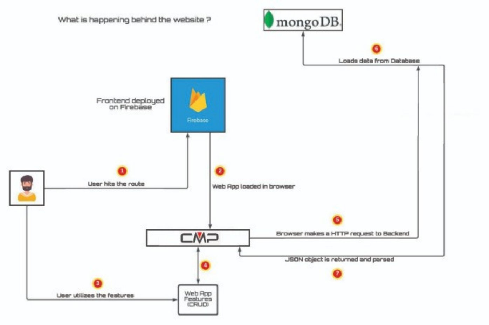
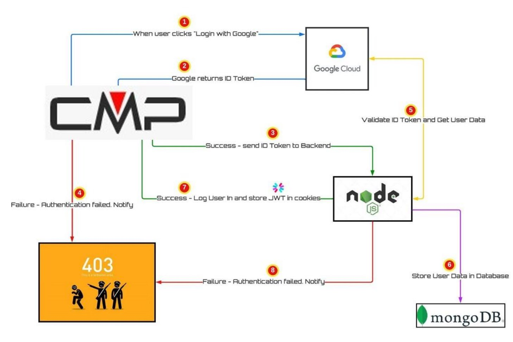
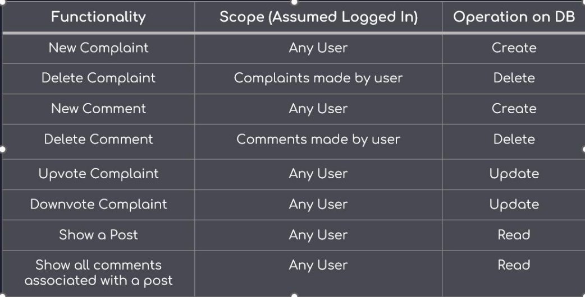
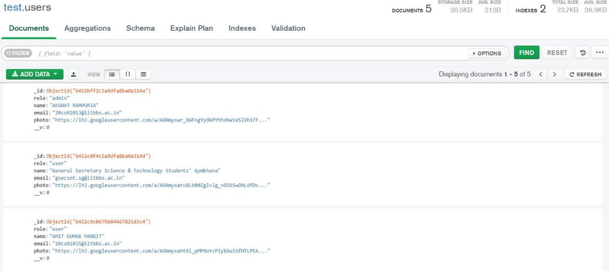
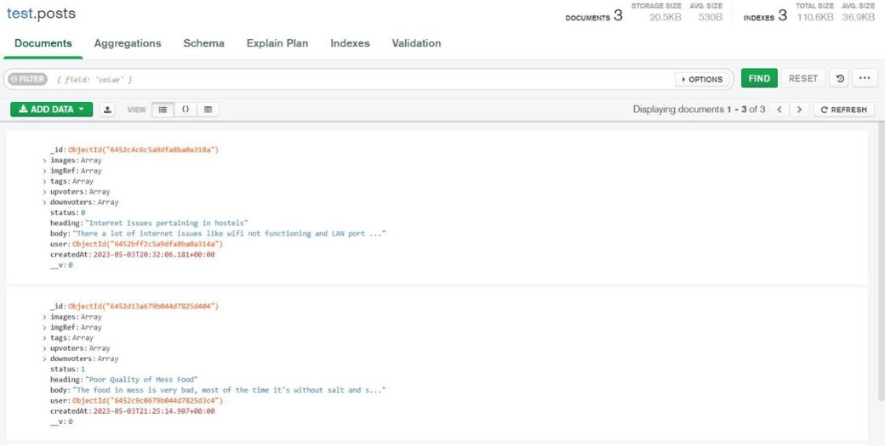
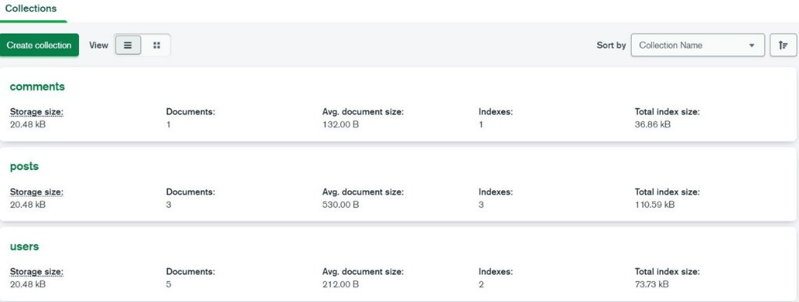
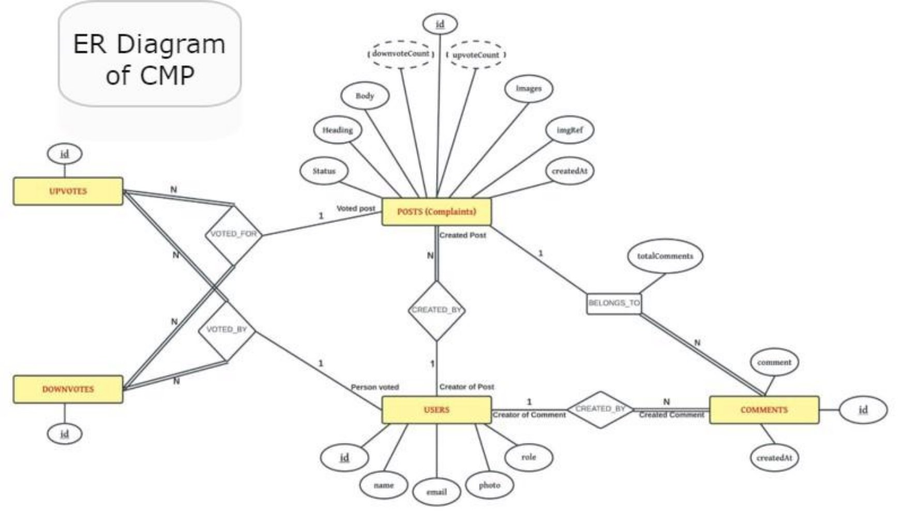

<h1 align = "center"> Complaint Management Portal </h1>

<h2 id="content"> 📝 Contents </h2>

[Technologies Used](#tech)

<h2 id="tech"> ⚡ Technologies Used </h2>
<ul>
  <li> NodeJS - Event I/O for backend </li>
  <li> Express - Fast node.js network app framework </li>
  <li> MongoDB - NoSQL Database </li>
  <li> React.js - Javascript library to build user frameworks. </li>
  <li> GoogleOAuth - Open Authorization from Google </li>
  <li> Bootstrap - CSS framework for responsive frontend </li>
</ul>
**Complain Management Portal** 

**Course Instructor:                                                                                                          Submitted By: Dr.Padmalochan Bera                                                           Akshat Rampuria    (20CS02013)                                                                                                           Amit Kumar Pandit (20CS01035)                                                                                                           Kushagra Khare      (20CS02004)**

Introduction 

**Presentation Overview**

The  website  is  a  platform  to  simplify complaint management.

An integrated communication system enables  direct  communication  with customer service.

Timely  and  accurate  responses  to complaints  lead  to  faster  resolution times.

Multiple  customers  can  log  their complaints  and  upvote  other complaints.

**Key Takeaways**

On a very basic level, complain management  portal  includes the  management  of  client complains for an organization. It  can  also  function  as  a feedback  mechanism  for  an admin.

We  maintain  different  tables for  users,  posts,  upvotes, downvotes,  comments  in  our database. 

Here clients can lodge a complaint with description and image details which  the  admin  has  to  resolve. Other  users  can  sign  in  and  then give  an  upvote  to  the  complaints lodged.

**How does the website work ? **

**User Authentication**

**Understanding Complaint Management Functionalities** 

**Screenshots of how entries are stored in DB** 

**Screenshots of how entries are stored in DB**

**Future Developments**

Integrate  AI  and  machine  learning  algorithms  to automate the complaint handling  process, such as categorizing  complaints,  suggesting  possible resolutions,  and  assigning  them  to  the  relevant teams.

Implement sentiment analysis to better understand the  emotional  context  of  complaints  and  provide personalized responses to customers.

Provide  customers  with  self-service  options  to resolve simple complaints, such as an FAQ section, chatbots, or a knowledge base.

Enable  collaboration  between  departments  to better  address  complex  complaints  that  require input from multiple teams.

Implement  a  rating  and  feedback  system  to evaluate  the  effectiveness  of  the  complaint handling process and continuously improve it.
